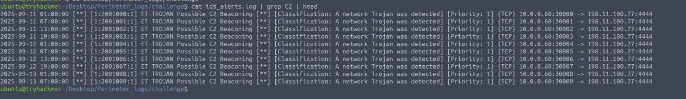
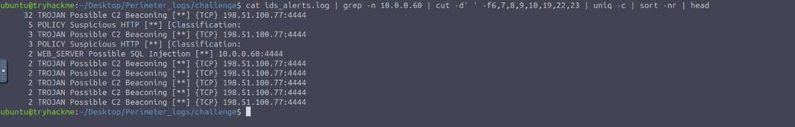
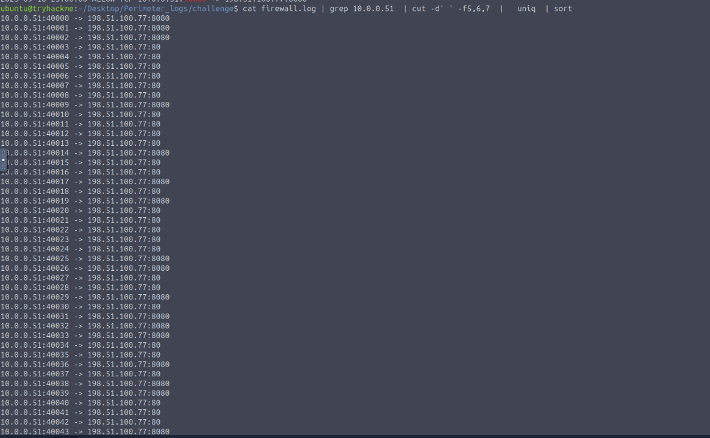
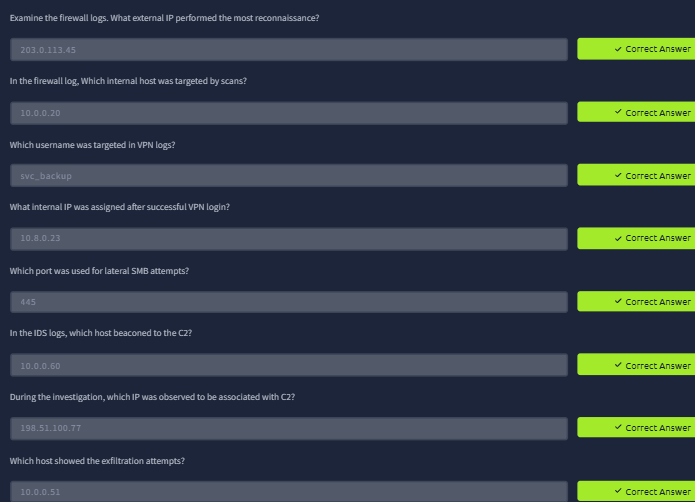

# Screenshot Evidence

These screenshots are from the completed TryHackMe lab and are included to support the major conclusions in the investigation.

## 05 — C2 Beaconing: Raw IDS Events

**Command shown:** `cat ids_alerts.log | grep C2 | head`

**What it proves:** The IDS repeatedly generated `ET TROJAN Possible C2 Beaconing` alerts from `10.0.0.60` to `198.51.100.77:4444`. The visible events recur at regular intervals across September 11–13, 2025, supporting the conclusion that `10.0.0.60` was beaconing to the external C2 infrastructure.

---

## 06 — C2 Alert Summary for the Infected Host

**Command shown:** `cat ids_alerts.log | grep -n 10.0.0.60 | cut -d' ' -f6,7,8,9,10,19,22,23 | uniq -c | sort -nr | head`

**What it proves:** Pivoting directly on `10.0.0.60` shows C2 beaconing as the dominant alert type in the displayed results, repeatedly associated with `198.51.100.77:4444`. Other alert categories are also visible, showing that the host generated multiple types of suspicious IDS activity.

---

## 07 — Outbound Connections During the Exfiltration Stage

**Command shown:** `cat firewall.log | grep 10.0.0.51 | cut -d' ' -f5,6,7 | uniq | sort`

**What it proves:** `10.0.0.51` (`APP-WEB-01`) repeatedly communicated with `198.51.100.77` over ports `80` and `8080`. This screenshot supports the outbound-connection portion of the exfiltration investigation. On its own, it does **not** prove that data theft succeeded; that conclusion remains limited to **potential data exfiltration / exfiltration attempts** when correlated with the IDS `Possible HTTP POST Large Upload` alerts.

---

## 08 — Lab Answer Verification

**What it proves:** The completed lab verifies the key investigation values used throughout this repository:

| Question | Verified Answer |
|---|---|
| External IP with the most reconnaissance activity | `203.0.113.45` |
| Internal host targeted by scans | `10.0.0.20` |
| VPN username targeted | `svc_backup` |
| Internal IP assigned after successful VPN login | `10.8.0.23` |
| Port used for lateral SMB attempts | `445` |
| Host that beaconed to the C2 | `10.0.0.60` |
| IP associated with C2 | `198.51.100.77` |
| Host showing exfiltration attempts | `10.0.0.51` |

---

## Screenshots Still Worth Adding

The current screenshots prove the C2, outbound exfiltration-stage connections, and final lab answers. To make the GitHub project visually complete, the strongest additional screenshots would be:

1. `01-reconnaissance-source-count.png`
   - Show `203.0.113.45` as the source with the highest blocked-request count.

2. `02-vpn-failures-to-success.png`
   - Show repeated failures against `svc_backup` followed by a successful login and assignment of `10.8.0.23`.

3. `03-internal-reconnaissance.png`
   - Show activity from `10.8.0.23` toward internal systems over SSH/SMB/RDP.

4. `04-smb-lateral-movement.png`
   - Show the IDS `Possible MS-SMB Lateral Movement` events over TCP/445.

5. `09-potential-exfiltration-ids-alerts.png`
   - Show `Possible HTTP POST Large Upload` events classified as `Potential Data Exfiltration`.

6. `10-splunk-timeline.png` *(optional)*
   - Show a Splunk search that ties multiple stages of the attack together.

## Screenshot Rule

Every screenshot should answer:

> **What does this prove in the investigation?**

Avoid screenshots that only show the tool interface without adding evidence.
