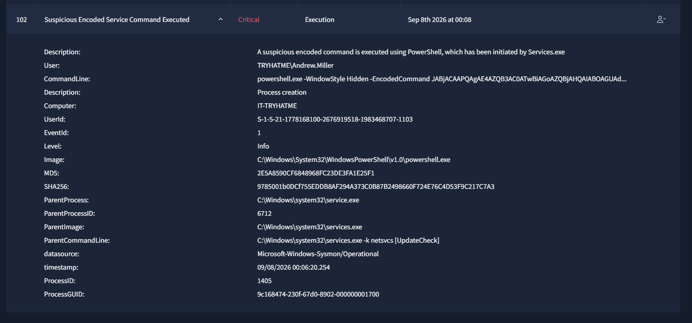
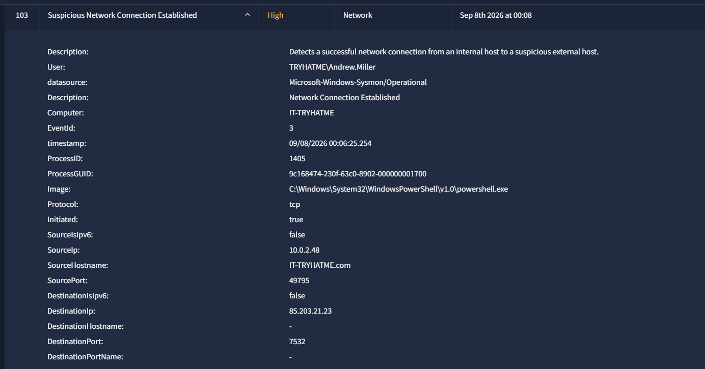
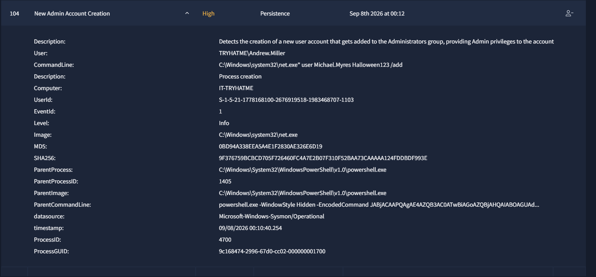
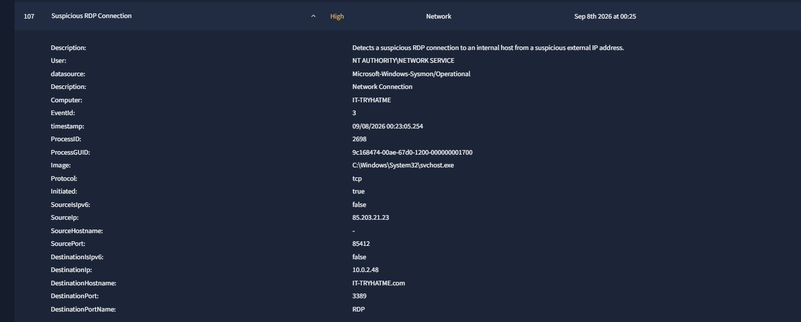
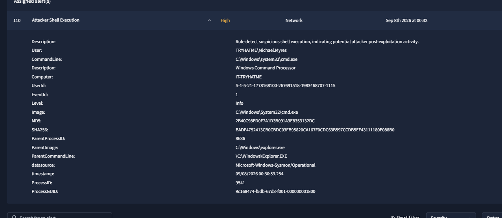
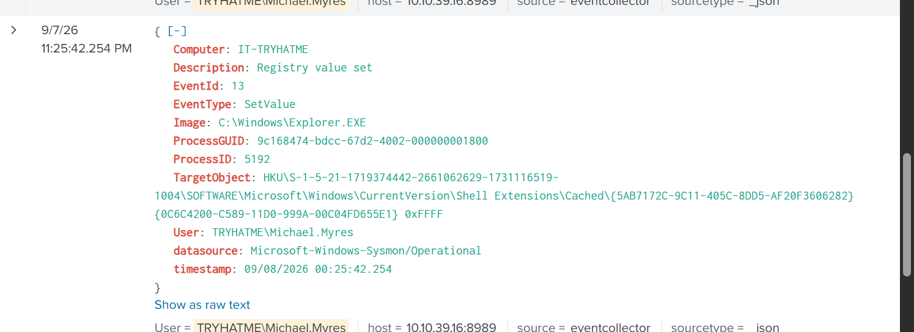
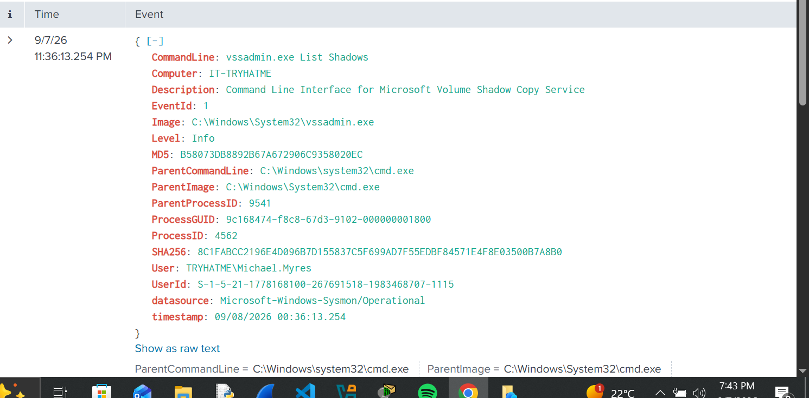
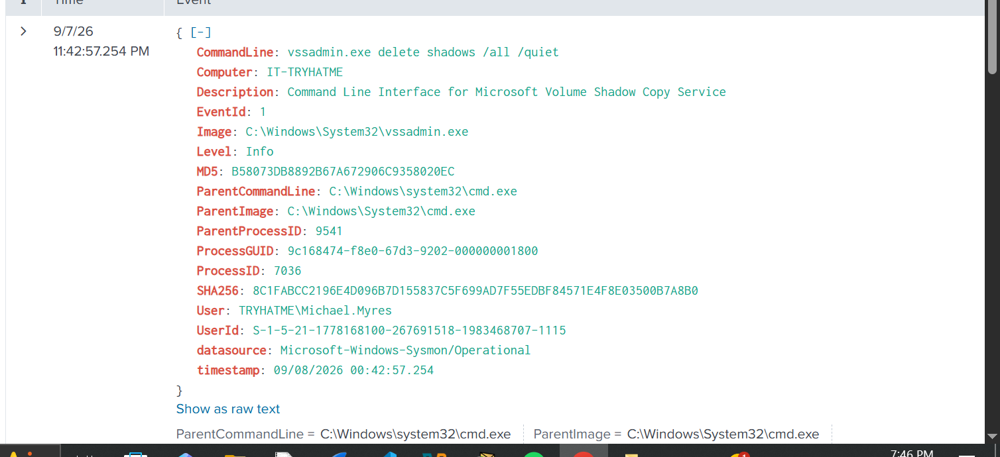
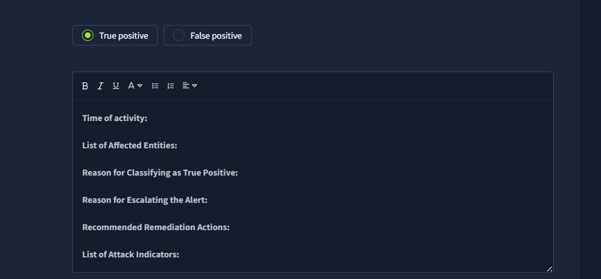

# Screenshot Evidence

These screenshots are from the completed Windows endpoint investigation and support the major conclusions documented in this repository.

## 01 — Encoded PowerShell Alert

**What it proves:** Sysmon Event ID `1` recorded `powershell.exe` running with `-WindowStyle Hidden -EncodedCommand` on `IT-TRYHATME` as `TRYHATME\Andrew.Miller`. The alert also shows PowerShell PID `1405`, parent PID `6712`, and a `services.exe` parent context containing `[UpdateCheck]`.

---

## 02 — PowerShell Outbound Connection

**What it proves:** Sysmon Event ID `3` tied PowerShell PID `1405` to TCP traffic from `10.0.2.48:49795` to `85.203.21.23:7532`, directly correlating the suspicious PowerShell process with external network activity.

---

## 03 — New Account Creation

**What it proves:** A later Sysmon Event ID `1` shows `net.exe` launched from the suspicious PowerShell process and executing a command that creates the account `Michael.Myres`. The alert is titled **New Admin Account Creation**; however, the visible command line directly proves account creation, not the separate Administrators-group membership command.

---

## 04 — Suspicious RDP Connection

**What it proves:** A later Sysmon Event ID `3` records an RDP connection involving source IP `85.203.21.23` and destination `10.0.2.48:3389` on `IT-TRYHATME`. This shows the same external IP later appearing in RDP-related activity against the compromised endpoint.

---

## 05 — Attacker Shell Execution

**What it proves:** Sysmon Event ID `1` records `cmd.exe` executing on `IT-TRYHATME` under `TRYHATME\Michael.Myres`, with `explorer.exe` as the parent process. This supports follow-on command-shell activity after creation of the new account.

---

## 06 — Registry Value Set

**What it proves:** Sysmon Event ID `13` records a registry value being set by `explorer.exe` under `TRYHATME\Michael.Myres`. The target is under `HKU\...\SOFTWARE\Microsoft\Windows\CurrentVersion\Shell Extensions\Cached\...`. The screenshot proves registry modification, but this specific key does not by itself prove a persistence mechanism.

---

## 07 — Shadow Copy Discovery

**Command shown:** `vssadmin.exe List Shadows`

**What it proves:** `vssadmin.exe` was executed under `TRYHATME\Michael.Myres` to enumerate existing Volume Shadow Copies.

---

## 08 — Shadow Copy Deletion

**Command shown:** `vssadmin.exe delete shadows /all /quiet`

**What it proves:** The user context `TRYHATME\Michael.Myres` executed a command that deletes all Volume Shadow Copies without prompting. This directly supports an **Inhibit System Recovery** conclusion for this event.

---

## 09 — True-Positive Classification

**What it proves:** The case-report interface shows the incident being classified as a **True positive** and prepared for escalation/remediation documentation.

---

## Evidence Still Worth Adding

The current screenshots cover the strongest PowerShell, network, account, RDP, shell, registry, and shadow-copy evidence. Two useful additions would still strengthen the repository if you have them:

1. **`whoami` execution** — to directly screenshot the user/context discovery command already identified during the investigation.
2. **Administrators-group membership change** — to directly show the event or command that added `Michael.Myres` to the local `Administrators` group.

## Screenshot Rule

Every screenshot should answer:

> **What does this prove in the investigation?**

The repository distinguishes what the screenshot directly proves from what is only suggested by the alert title or surrounding case context.
