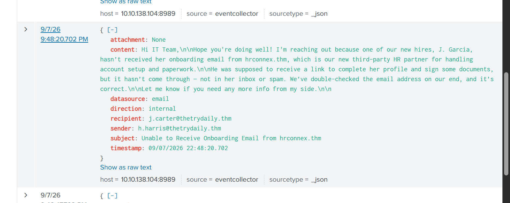

# Case 02 — Legitimate Email False Positive

## The Problem

An email-related alert required validation to determine whether the message represented phishing or normal business communication.

## What I Investigated

I reviewed the sender, recipient, subject, direction, attachment field, and the business context described in the message. I also considered whether there was suspicious network follow-on activity that would support a phishing interpretation.

## What I Found

The recovered email event shows:

- **Sender:** `h.harris@thetrydaily.thm`
- **Recipient:** `j.carter@thetrydaily.thm`
- **Direction:** Internal
- **Subject:** `Unable to Receive Onboarding Email from hrconnex.thm`
- **Attachment:** None
- The message discusses a new hire, J. Garcia, not receiving an expected onboarding message from the third-party HR partner `hrconnex.thm`.

The content is consistent with an internal support request about a normal onboarding workflow. The reviewed context did not show malicious attachment execution or suspicious follow-on activity.

## Classification

**False Positive**

The alert was closed as legitimate business email activity in the lab context.

## Escalation

**No**

There was not enough evidence of phishing, credential theft, malware execution, or malicious network activity to justify escalation.

## What I Learned

An email can contain external domains or links without automatically being malicious. Sender context, direction, attachments, authentication, user interaction, and network evidence should be correlated before classifying the message.

## Evidence

The screenshot captures the internal email event and the onboarding context used during triage.
