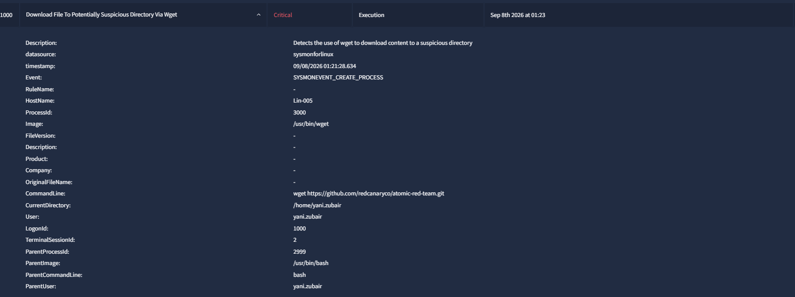
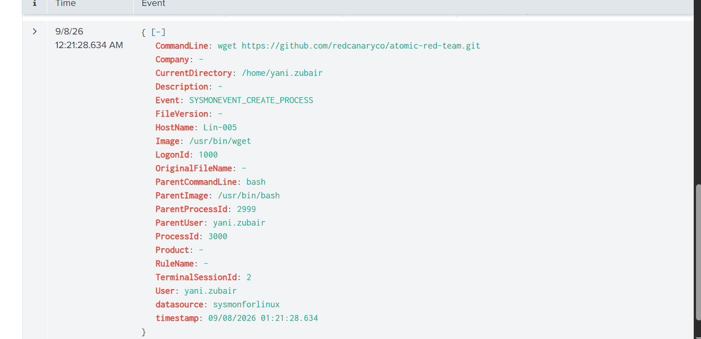
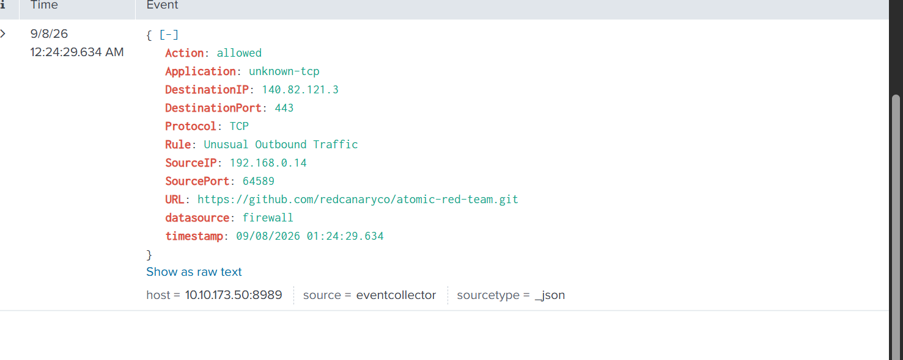
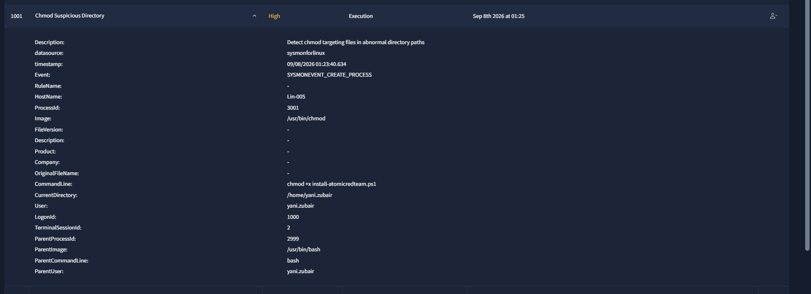
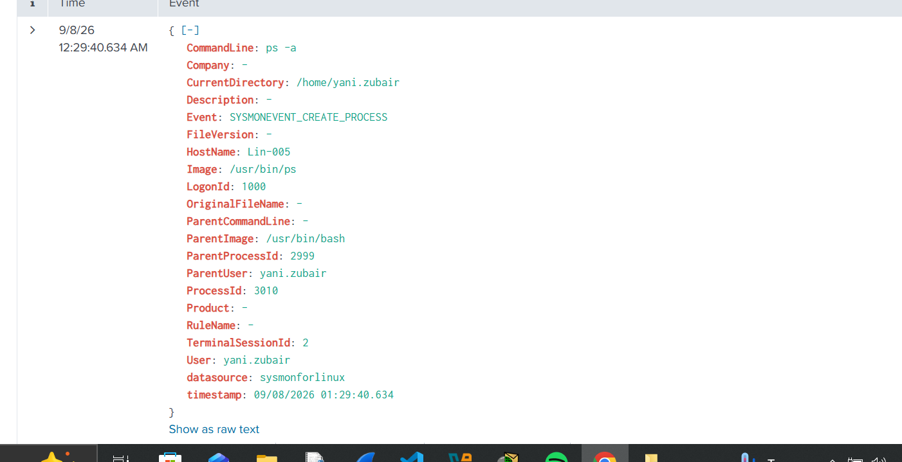
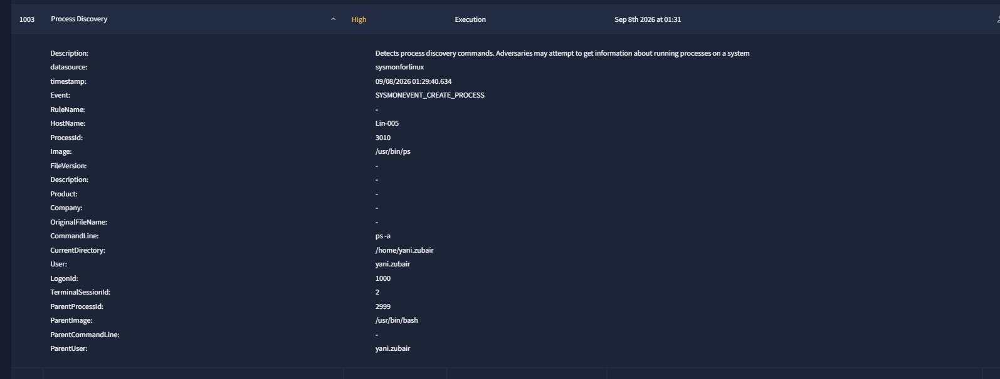
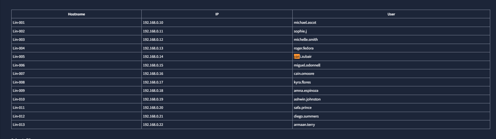
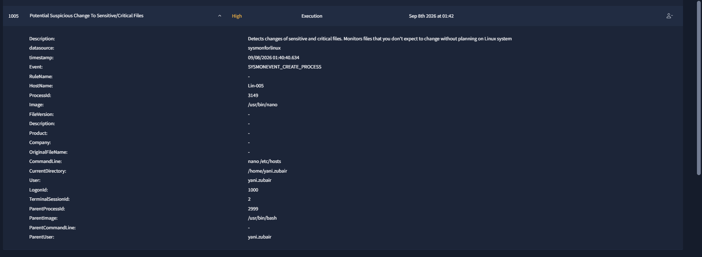

# Case 03 — Atomic Red Team

## The Problem

Several high-severity Linux alerts were generated by activity that can resemble adversary behavior: downloading tooling, changing execute permissions, process discovery, and visiting an IP-reputation site.

## What I Investigated

I correlated the alerts by user, host, command line, source repository, firewall activity, and follow-on behavior instead of treating each alert independently.

## What I Found

The activity was tied to **Yani Zubair** on **Lin-005** (`192.168.0.14`).

Key evidence included:

- `wget https://github.com/redcanaryco/atomic-red-team.git`
- Firewall telemetry showing the GitHub connection was allowed
- `chmod +x install-atomicredteam.ps1`
- `ps -a`, which triggered a Process Discovery alert
- A later visit to `abuseipdb.com`, consistent with checking IP reputation during security work
- Additional same-user `/etc/hosts` editing activity that was reviewed as context, but was not itself treated as proof of compromise

The GitHub source was the Red Canary Atomic Red Team repository, and the related commands were consistent with security-testing activity. The same-user/session context and lack of malicious follow-on behavior supported a benign explanation.

## Classification

**False Positive**

The alerts represented legitimate security-testing / IT activity rather than confirmed compromise.

## Escalation

**No**

The available evidence supported authorized testing context and did not show payload execution, persistence, credential theft, or malicious command-and-control behavior.

## What I Learned

Commands such as `wget`, `chmod`, and `ps` are not malicious by themselves. Their meaning depends on who ran them, where the content came from, what the user was doing, and what happened afterward.

## Evidence

