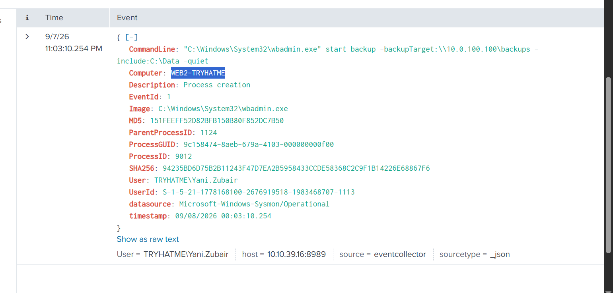
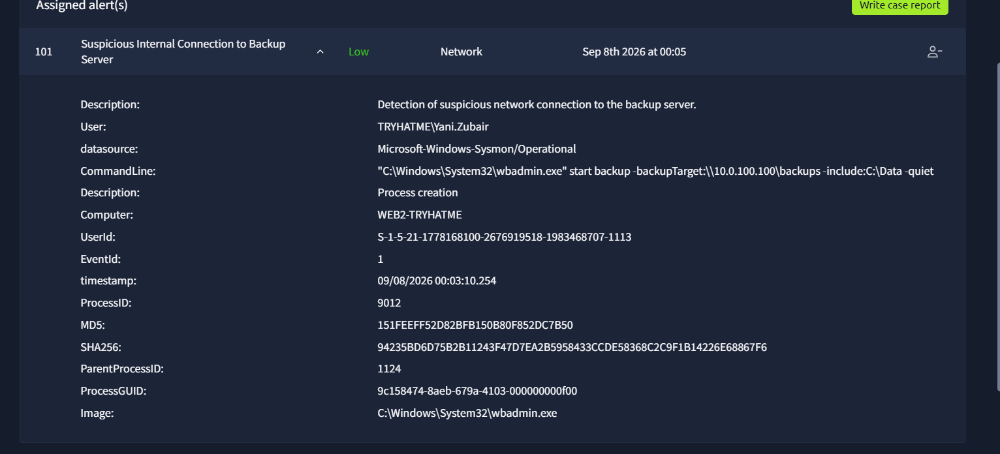

# Case 04 — Administrative Tool Activity

## The Problem

A low-severity alert flagged an internal connection to a backup server. The activity involved `wbadmin.exe`, a legitimate Windows administrative backup utility that can also appear in suspicious activity.

## What I Investigated

I reviewed the executable path, command line, user, host, destination, and the purpose of the operation.

## What I Found

The event shows:

- **User:** `TRYHATME\Yani.Zubair`
- **Host:** `WEB2-TRYHATME`
- **Image:** `C:\Windows\System32\wbadmin.exe`
- **Command:** `"C:\Windows\System32\wbadmin.exe" start backup -backupTarget:\\10.0.100.100\backups -include:C:\Data -quiet`
- **Alert:** `Suspicious Internal Connection to Backup Server`

The executable is running from the expected Windows system path and the command is explicitly starting a backup of `C:\Data` to an internal backup share.

## Classification

**False Positive**

The behavior matched legitimate administrative backup activity rather than attacker use of a living-off-the-land binary.

## Escalation

**No**

No malicious parent process, unexpected executable path, destructive backup behavior, or suspicious follow-on activity was identified in the reviewed evidence.

## What I Learned

A legitimate Windows binary can still trigger useful detections. The correct decision comes from validating the command arguments, user role, host, destination, process path, and surrounding activity rather than automatically trusting or distrusting the tool name.

## Evidence

