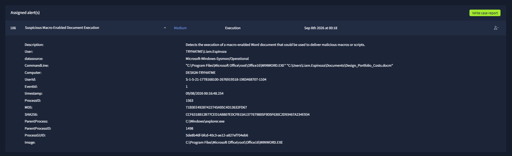
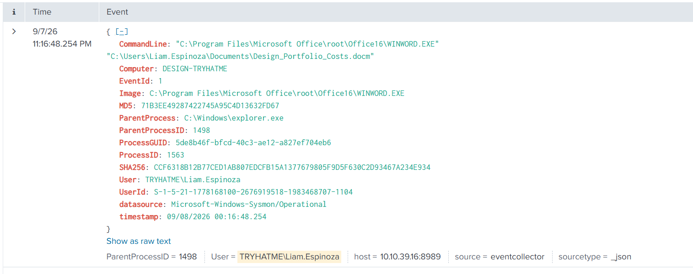
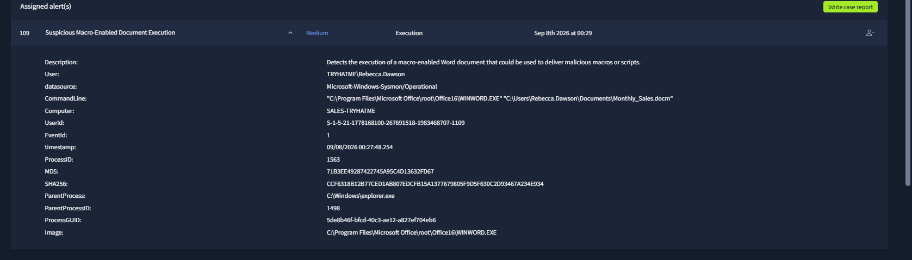
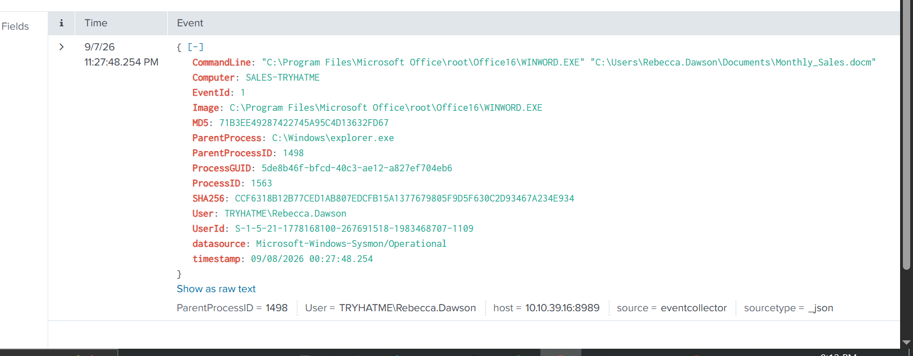
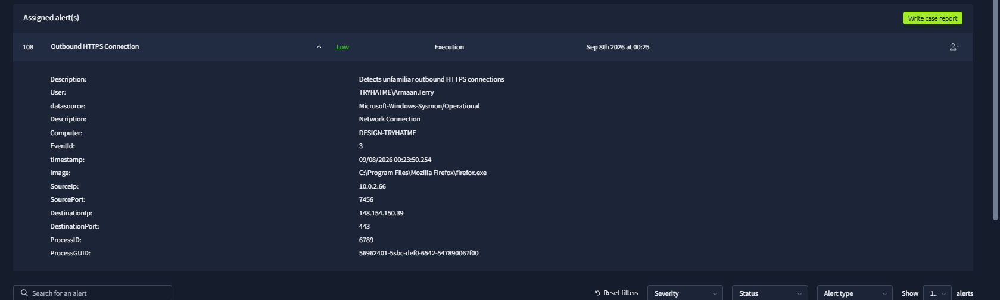
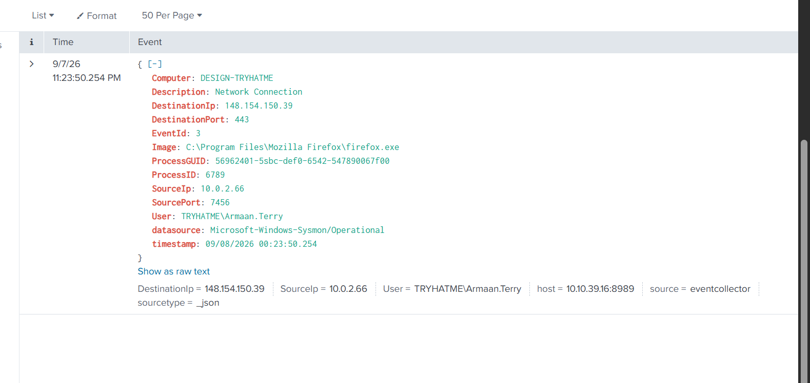
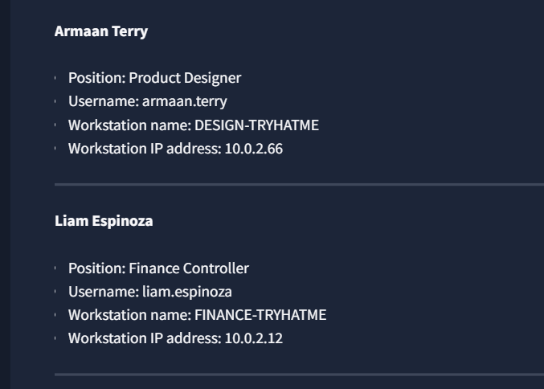

# Case 05 — Macro Document Investigation

## The Problem

Two alerts involved macro-enabled Microsoft Word documents (`.docm`), a file type that can legitimately contain macros but is also commonly abused for malicious script execution.

## What I Investigated

I reviewed the Word process events, parent process, document paths, affected users/workstations, and nearby browser/network activity. I looked specifically for suspicious child processes or network behavior that would indicate a macro had launched a payload.

## What I Found

Two document executions were captured:

1. `Design_Portfolio_Costs.docm`
   - User: `TRYHATME\Liam.Espinoza`
   - Computer: `DESIGN-TRYHATME`
   - Parent: `C:\Windows\explorer.exe`

2. `Monthly_Sales.docm`
   - User: `TRYHATME\Rebecca.Dawson`
   - Computer: `SALES-TRYHATME`
   - Parent: `C:\Windows\explorer.exe`

The screenshots also show Firefox network activity from `DESIGN-TRYHATME` for `Armaan.Terry`, which was reviewed separately as surrounding context.

No recovered evidence in this case shows Word spawning PowerShell, `cmd.exe`, `wscript.exe`, `mshta.exe`, or another suspicious child process. The displayed hashes are tied to the logged process image and should not be treated as proof that the document itself was benign.

## Classification

**False Positive**

Based on the available lab evidence, the alerts were closed because macro-enabled documents were opened without the malicious follow-on behavior expected from an executed payload.

## Escalation

**No**

There was no confirmed macro payload execution, persistence, credential access, or malicious outbound connection in the reviewed evidence.

## What I Learned

The `.docm` extension is a reason to investigate, not a conclusion. The most useful evidence is what Word does next: child processes, scripts, file writes, registry changes, and network connections.

## Evidence

