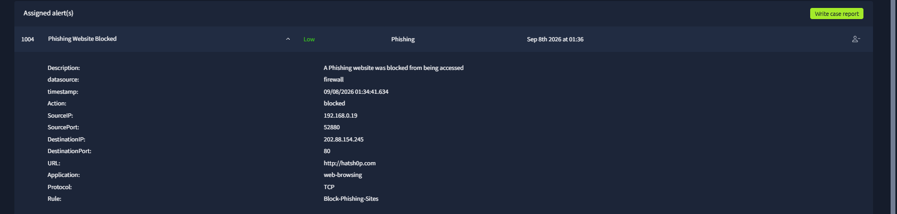
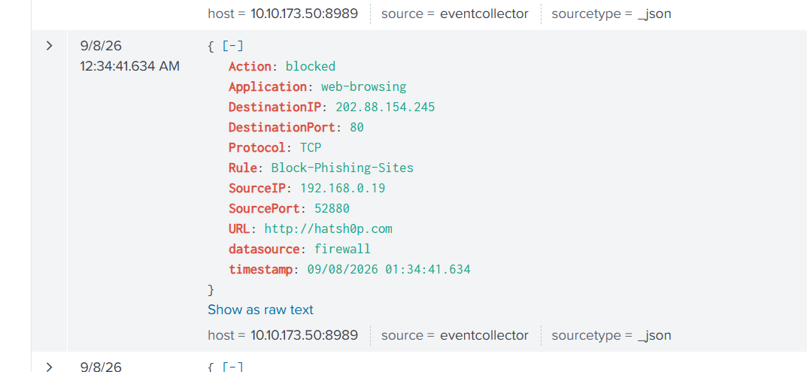
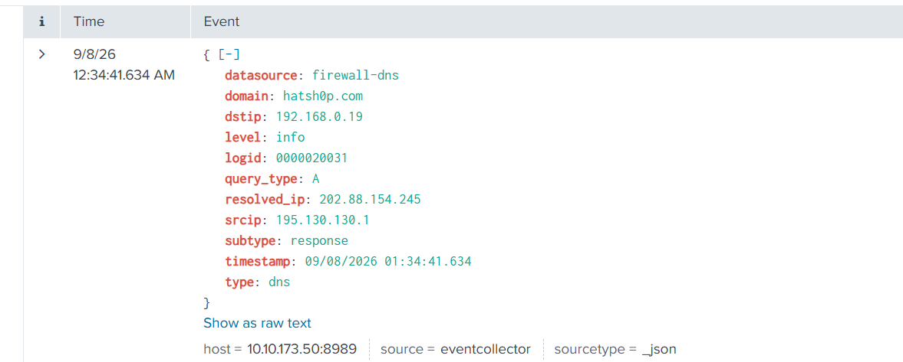

# Case 06 — DNS / Firewall Alert

## The Problem

A low-severity phishing alert showed a DNS lookup and a firewall block for `hatsh0p.com`. The task was to decide whether the event represented compromise, a blocked attempt, or activity requiring escalation.

## What I Investigated

I correlated the DNS response with the firewall event and verified whether the client was able to establish the suspicious connection.

## What I Found

The evidence shows:

- **Domain:** `hatsh0p.com`
- **Resolved IP:** `202.88.154.245`
- **Internal client:** `192.168.0.19`
- **Destination port:** `80/TCP`
- **Firewall rule:** `Block-Phishing-Sites`
- **Firewall action:** `blocked`
- **Alert:** `Phishing Website Blocked`

The DNS event confirms name resolution, while the firewall event confirms that the subsequent web request was blocked. The available evidence did not show a successful connection, payload execution, or endpoint compromise.

## Classification

**Blocked suspicious / phishing activity**

This is best treated as a valid security-control event rather than proof that the endpoint was compromised.

## Escalation

**No, based on the available evidence**

A single blocked request with no successful follow-on activity did not justify escalation in the lab. Escalation would become appropriate if the same user/host repeatedly attempted access, another destination was contacted successfully, credentials were submitted, or endpoint indicators appeared.

## What I Learned

DNS resolution and successful web access are different events. A host can resolve a malicious domain and still be prevented from reaching it by the firewall. Triage should verify both stages before claiming compromise.

## Evidence

